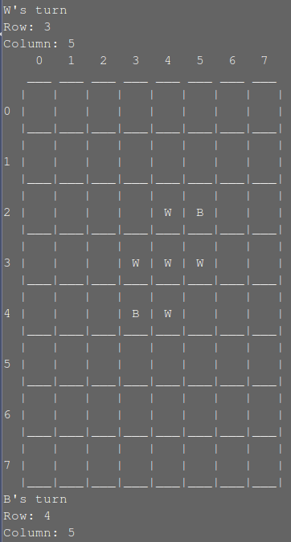

# cpp-games

A collection of small games written in C++ using OOP including Chess, Checkers, Connect 4, Hangman, Conway's Game of Life, Tic-Tac-Toe and a block letter printing program.

|     |     |
| --- | --- |
|  |  |
|  |  |
|  |  |
|  |

To run locally:

```$ git clone https://github.com/rileythomp/cpp-games.git```

```$ cd game_to_play```

```$ make```

```$ ./game_to_play```


